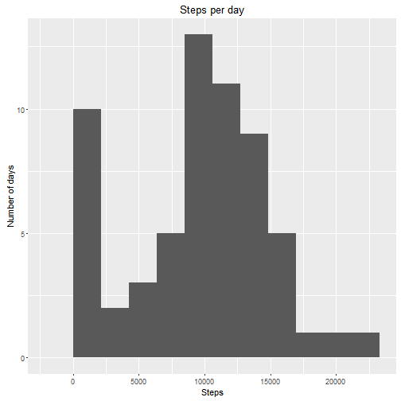
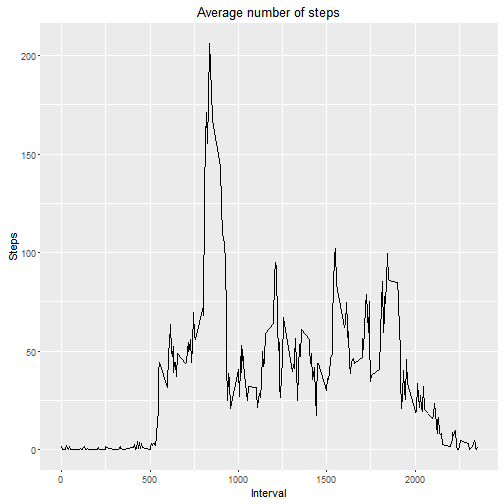
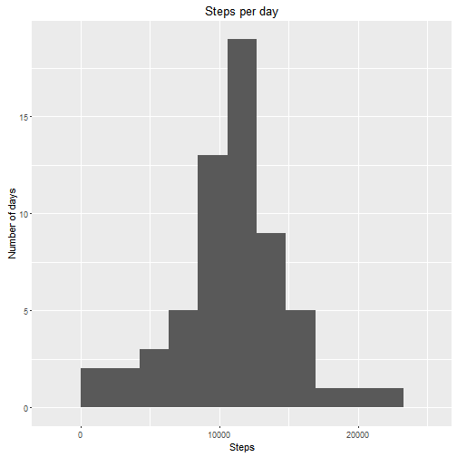
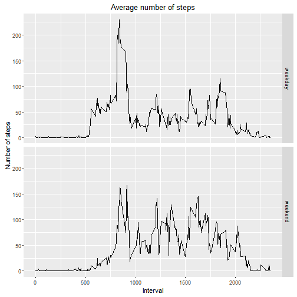

## Loading and preprocessing the data

Data will be loaded into a dataframe directly from the zipped CSV file

```r
df = read.csv(unz("activity.zip", "activity.csv"))
```

Summary of the data

```r
summary(df)
```

```
##      steps                date          interval     
##  Min.   :  0.00   2012-10-01:  288   Min.   :   0.0  
##  1st Qu.:  0.00   2012-10-02:  288   1st Qu.: 588.8  
##  Median :  0.00   2012-10-03:  288   Median :1177.5  
##  Mean   : 37.38   2012-10-04:  288   Mean   :1177.5  
##  3rd Qu.: 12.00   2012-10-05:  288   3rd Qu.:1766.2  
##  Max.   :806.00   2012-10-06:  288   Max.   :2355.0  
##  NA's   :2304     (Other)   :15840
```

## What is mean total number of steps taken per day?

Calculate the total number of steps per day

```r
stepsPerDay = aggregate(df$steps,list(df$date),sum,na.rm=TRUE)
names(stepsPerDay) = c("date", "steps")
```

Histogram about the number of steps per day

```r
library(ggplot2)
p = ggplot(stepsPerDay) + geom_histogram(aes(steps),bins=10) +
  labs(title="Steps per day", x="Steps", y="Number of days")
print(p)
```



Mean number of steps per day

```r
mean(stepsPerDay$steps)
```

```
## [1] 9354.23
```

Median of steps per day

```r
median(stepsPerDay$steps)
```

```
## [1] 10395
```

## What is the average daily activity pattern?

Average of steps per interval, across all the days

```r
stepsPerInterval = aggregate(df$steps,list(df$interval),mean,na.rm=TRUE)
names(stepsPerInterval) = c("interval", "steps")
p = ggplot(stepsPerInterval) + geom_line(aes(interval,steps)) +
  labs(title="Average number of steps", x="Interval", y="Steps")
print(p)
```



5-minute interval when the number of steps is maximum

```r
stepsPerInterval[which.max(stepsPerInterval$steps),1]
```

```
## [1] 835
```
## Imputing missing values

Number of missing (N/A) entries

```r
sum(is.na(df$steps))
```

```
## [1] 2304
```

Missing values will be filled using the mean value for the same interval in other days when the value is not missing.
A new dataset will be created using this strategy

```r
df.full = df
for (i in 1:nrow(df.full))
{
    if (is.na(df.full[i,1]))
    {
        df.full[i,1] = stepsPerInterval[match(df.full[i,3],stepsPerInterval$interval),2]
    }
}
```

Making again the histogram with this *full* dataset

```r
stepsPerDayFull = aggregate(df.full$steps,list(df.full$date),sum)
names(stepsPerDayFull) = c("date", "steps")
p = ggplot(stepsPerDayFull) + geom_histogram(aes(steps),bins=10) +
  labs(title="Steps per day", x="Steps", y="Number of days")
print(p)
```




Recalculating the mean

```r
mean(stepsPerDayFull$steps)
```

```
## [1] 10766.19
```

Recalculating the median

```r
median(stepsPerDayFull$steps)
```

```
## [1] 10766.19
```

Histogram and values are now different. Using this strategy, the number of days with low steps has decreased dramatically. Also mean and media are now higher.

## Are there differences in activity patterns between weekdays and weekends?

Creating a factor variable to distinguish between weekdays and weekends

```r
df.full$dayType = "weekday"
df.full[weekdays(as.Date(df.full$date)) %in% c("Saturday","Sunday"),4] = "weekend"
df.full$dayType = as.factor(df.full$dayType)
```

Comparing weekdays and weekends graphically

```r
stepsPerIntervalFull = aggregate(df.full$steps,list(df.full$dayType,df.full$interval),mean)
names(stepsPerIntervalFull) = c("dayType", "interval", "steps")
p = ggplot(stepsPerIntervalFull) + geom_line(aes(interval,steps)) + facet_grid(dayType ~ .) + labs(title="Average number of steps", x="Interval", y="Number of steps")
print(p)
```


